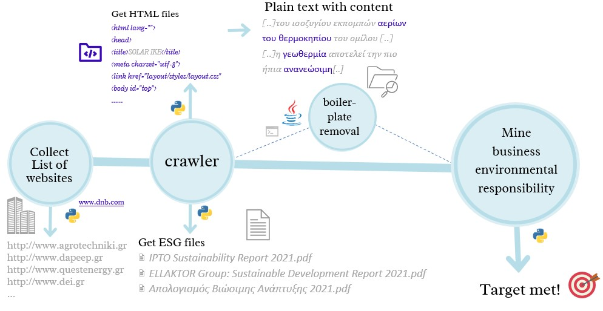

# Websites extraction
In this repository there are files are part of the Thesis:  
[Automating the data acquisition of Businesses and their actions regarding environmental sustainability: The Energy Industry in Greece](content_for_user/Thesis_DI_CBorovilou.pdf)

The pipeline of the procedure that is described in the thesis file, is shown in the image below and at the repository can be found the code for the individual steps   
<!-- Parts of the data engineering process that is described in the thesis file,  written in Python & all together consist the pipeline of the procedure, are shown in the image below: -->

## Pipeline
The steps are the following:
1. Extract a **list** with domains of all the Greek businesses that belong to the energy factor (result: [data_from_dnb](content_for_user/data_from_dnb.json)  (source www.dnb.com) )
2. Use a crawler algorithm that will navigate to the URLs in our [file](content_for_user/data_from_dnb.json) as well as all the links that lead to other links & will extract their content (HTML files). Moreover it will extract document files (.pdf) refering to ESG factors using a _custom_ dictionary  [ESG Dictionary](content_for_user/esg_dict.csv)
 (script related &rightarrow; [crawler_pdfs.py](venv_tst/Scripts/Crawler_pdfs.py))
3. Use a boiler plate removal algorithm that removes HTML syntax and keep only the text (not publicly available in the repository)
4. Evaluate web-scrapping process: 
    - calculate percentage of successfully downloaded webpages
    - Calculate tokens found
    - Extract 
    Extract useful information:
    - Find innovative products of businesses (using trademarks)
    - Filter accordingly interesting content in order to distill the action of greek businesses regarding environmental responsability.   
  Export the results in a csv (script related &rightarrow; [meta_cleaning_2.py](venv_tst/Scripts/meta_cleaning_2.py) )

* There is also available a script of the crawler designed to read local HTML files (instead of URLs as decribed in step 2), in order to extract ESG pdf files. (script related &rightarrow; [Crawler_pdfs_from_html_files.py](venv_tst/Scripts/Crawler_pdfs_from_html_files.py))

## How to run
- [Crawler_pdfs_from_html_files.py](venv_tst/Scripts/Crawler_pdfs_from_html_files.py) 
   In order to run the script, user needs to give as input 2 parameters: 
    1. The local **input path** that contains folders per website under which there are stored all HTML files  
        (Input parameter parameter: _--inpath_)   (e.g. --inpath C:\Users\userXXX\inp)   
       (_Sample input data_ can be found [here](content_for_user/example%20with%20sample%20data%20(before%20run%20-%20no%20results).zip) )
    2. The local **output path** that user desires to store the results (ESG/Sustainability pdf files) per website  
       (Input parameter parameter: _--out_dir_)   (e.g. --out_dir C:\Users\userXXX\out)   
       (_Example of input & output data_ can be found [here](content_for_user/example%20with%20sample%20data%20(after%20run%20-%20with%20results%20).zip) )
   
   Thus the command at terminal will be similar to: `C:\Users\userXXX\...\python.exe C:\Users\userXXX\...\Crawler_pdfs_from_html_files.py --inpath C:\Users\userXXX\D..\inp --out_dir C:\Users\userXXX\..\out` .
   
   Optional feature:
After first run a (default) dictionary for words of interest ([ESG Dictionary](content_for_user/esg_dict.csv)) is generated at input forlder so that user can maintain it. 

- [Crawler_pdfs.py](venv_tst/Scripts/Crawler_pdfs.py)  
  Similarly, in order to run the script, user needs to give as input 2 parameters: 
    1. The local input path for [json file](content_for_user/data_from_dnb.json) that contains the websites under which there are stored all HTML files  
       (Input parameter parameter: _--inpath_)   (e.g. --inpath C:\Users\userXXX\inp\data_from_dnb.json)   
    2. The local output path that user desires to store the results (ESG/Sustainability pdf files) per website  
       (Input parameter parameter: _--out_dir_)   (e.g. --out_dir C:\Users\userXXX\out) 
   
    Thus the command at terminal will be similar to: `C:\Users\userXXX\...\python.exe C:\Users\userXXX\...\Crawler_pdfs.py --inpath C:\Users\userXXX\...\inp\data_from_dnb.json --out_dir C:\Users\userXXX\...\out` .

- [meta_cleaning_2.py](venv_tst/Scripts/meta_cleaning_2.py) 
  Similarly, In order to run the script, user needs to give as input 2 parameters: 
    1. The local **input path** contains folders with html files per website with the extracted plain text (**after** boilerplate removal).
     (Input parameter parameter: _--inpath_)   (e.g. --inpath C:\Users\userXXX\inp)   
   _Sample data to use as input:_ [html files with plain text in file system](content_for_user/sample_input_plain_text_html.zip)
    2. The local **output path** that user desires to store the results (ESG/Sustainability pdf files)   
       (Input parameter parameter: _--out_dir_)   (e.g. --out_dir C:\Users\userXXX\out)  
          
    Thus the command at terminal will be similar to: `C:\Users\userXXX\...\python.exe C:\Users\userXXX\...\Crawler_pdfs_from_html_files.py --inpath C:\Users\userXXX\D..\inp --out_dir C:\Users\userXXX\..\out`
   

## Install 

Run the command

`pip install -r requirements.txt`
<!-- 
## Requirements

- Jupyter Notebooks
- Numpy
- Pandas
- Matplotlib
- Seaborn
- Scipy
- Scikit-learn -->

<!-- ## Usage

Within the `notebooks` folder, there are two notebooks, they should be run in the following order:

1. `1_visulizing.ipynb`: Exploratory data analysis, cleaning and visualization.
2. `2_modeling.ipynb`: Feature engineering, preprocessing, ML Modeling and evaluation

I have put the `life_expectancy.csv` file containing the dataset in the `data` folder, and put it in the `.gitignore` file to avoid uploading it to GitHub, however, you can download it from the Kaggle link above. -->
